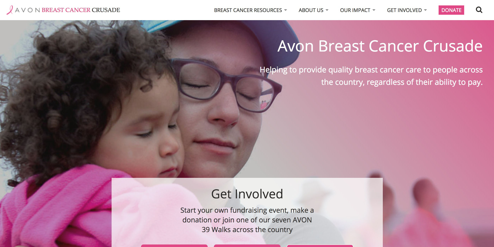
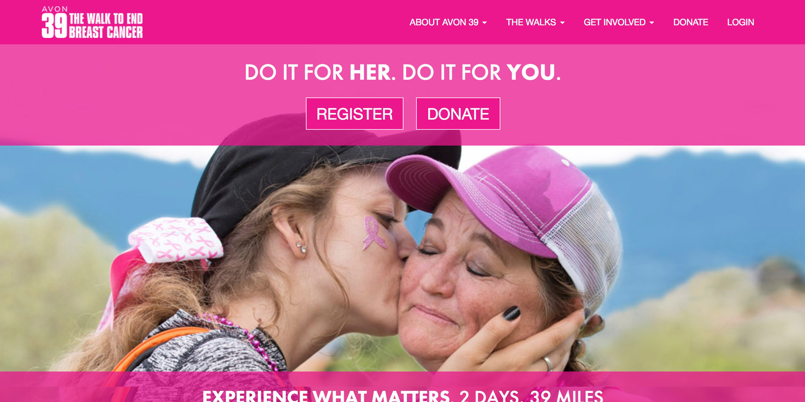
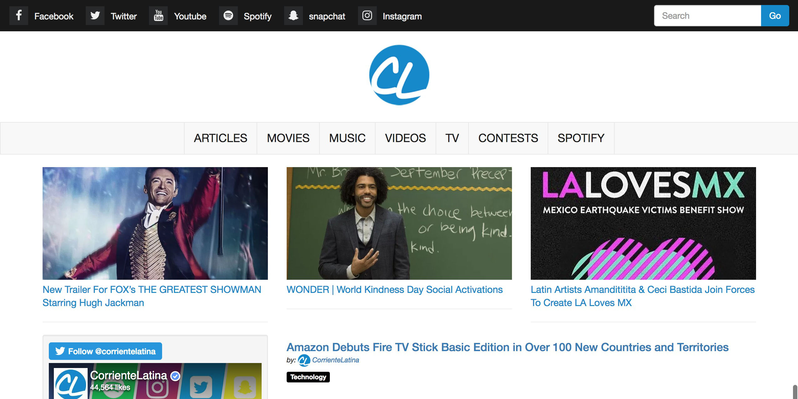
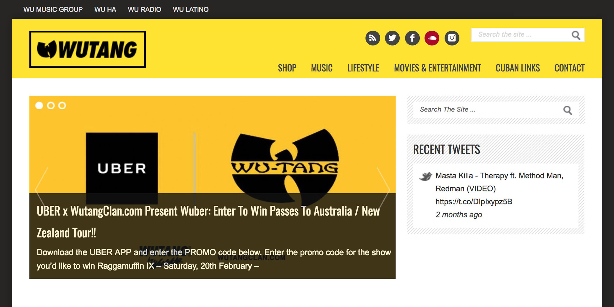

---
# You don't need to edit this file, it's empty on purpose.
# Edit theme's home layout instead if you wanna make some changes
# See: https://jekyllrb.com/docs/themes/#overriding-theme-defaults
layout: default
title: Richard Chiriboga
description: "Richard Chiriboga is a Technical Manager, Wordpress and Front-End Developer based out of New York City."
---

  

    <h1>Richard Chiriboga</h1>
    
Technical Manager, WordPress &amp; Front-end Developer

  

<section class="subtron resume">
  

    

      

        
View my <a class="btn btn-info btn-lg" href="/resume/Richard.Chiriboga.pdf" target="_blank"><strong>resume</strong></a>

      

    

  

</section>
<section id="aboutme">
  

    

      

        
      

      

          <h2><i class="fa fa-user-circle-o" aria-hidden="true"></i> Who Am I</h2>
          
Driven and collaborative Technical Manager with more than 20-years of experience in web development and management, across non-profit, boutique agency and global company environments. Expertise in leading website restructuring and development projects, corporate intranet builds, and content management plans through their complete life cycle – from ideation to launch. Known for being a trusted partner across multiple vendors, functions and disciplines, and having the ability to communicate complex information to both technical and non-technical users. Offers Hispanic marketing and social media expertise: Created award-winning website CorrienteLatina.com. Fluent in English, with intermediate Spanish fluency.

      

    

  

</section>

<section class="bt" id="skills">
  

    

      

        <h2><i class="fa fa-check-circle" aria-hidden="true"></i> Skills</h2>
      

    

    

      

        <ul class="list-unstyled">
          <li>HTML</li>
          <li>CSS</li>
          <li>Javascript</li>
          <li>jQuery</li>
          <li>WordPress</li>
        </ul>
      

      

        <ul class="list-unstyled">
          <li>PHP</li>
          <li>MySQL</li>
          <li>Luminate CMS</li>
          <li>Luminate Online</li>
          <li>Project Management</li>
        </ul>
      

      

        <ul class="list-unstyled">
          <li>Web Development</li>
          <li>Crisis Management</li>
          <li>Social Media/Marketing</li>
          <li>Business Relationship Development / Management</li>
          <li>Strategic Planning</li>
        </ul>
      

      

        <ul class="list-unstyled">
          <li>Team Leadership</li>
          <li>Vendor Negotiation</li>
          <li>Search Engine Optimization</li>
          <li>Technical Communication</li>
          <li>Project Multi-Tasking</li>
        </ul>
      

    

  

</section>

<section class="subtron" id="awards">
  

    

      

        <h2><i class="fa fa-trophy" aria-hidden="true"></i> Awards</h2>
      

    

    

      

        
<strong>2017 Jack Daniel's Neighborhood Flavors Honoree</strong> for "Movers &amp; Shakers to help the Hispanic Community in Queens, NY.

      

      

        
<strong>2016 Tecla Award for Best Latino News and Culture website</strong> at Hispanicize and sponsored by Telemundo.

      

      

        
<strong>2015 All-Star Mixtape Award</strong> Winner - Best Latin Music Website

      

      

        
<strong>4 Time Nominee</strong> for Best Latin Music Website at the Latin Mixx Awards

      

    

  

</section>

<section class="projects" id="projects">
  

    

      

        <h2><i class="fa fa-tasks" aria-hidden="true"></i> Web Projects</h2>
      

    

    

      

        
        <a href="https://avonbcc.org"><h4>AvonBcc.Org</h4></a>
        
100% Fully custom Wordpress theme built specifically for the Avon Breast Cancer Crusade featuring custom post types, custom fields and slick admin capabilities.

      

      

      

        
        <a href="http://avon39.org"><h4>AVON39.org</h4></a>
        
100% Custom Wordpress theme built for the Avon Breast Cancer Crusade flagship Program. Custom HTML/CSS/Jquery/ Luminate API. This project never launched.

      

      

      

        
        <a href="https://corrientelatina.com"><h4>Corrientelatina.com</h4></a>
        
My personal Blog where I work with Record Labels, Movie houses and marketing firms to bring US eyes to many products and services including advanced movie screenings, interviews and much more.

      

      

      

        
        <a href="http://wutangclan.com"><h4>Wutangclan.com</h4></a>
        
Built on top of a wordpress theme for one itteration of the world-famous Wutang Clan.

      

    

  

</section>

<section class="bt">
  

    

      

        <h2><i class="fa fa-tasks" aria-hidden="true"></i> <a href="https://github.com/chiriboga">Github Repositories</a></h2>
      

    

    

      

        <i class="fa fa-envelope fa-6" aria-hidden="true"></i>
      

      

        <a href="https://github.com/chiriboga/company-email-signature"><h4>Company Email Signature</h4></a>
        
Used by a few major corporations. This system was built using Twitter Bootstrap and AngularJS. Hs multi-lingual capabilities and much more.

      

      

      

        <i class="fa fa-wordpress fa-6" aria-hidden="true"></i>
      

      

        <a href="https://github.com/chiriboga/top-participants"><h4>Luminate Top Participants Plugin</h4></a>
        
A premium Wordpress Plugin for showing top participants, teams and groups from the Luminate API.

      

      

      

        <i class="fa fa-github fa-6" aria-hidden="true"></i>
      

      

        <a href="https://github.com/chiriboga/classy-org-api-v2"><h4>Classy.org API connection and use</h4></a>
        
After trying to find information from classy's documentation and searching the web, I was able to compile real world examples that I am hoping others can use for their projects

      

    

  

</section>